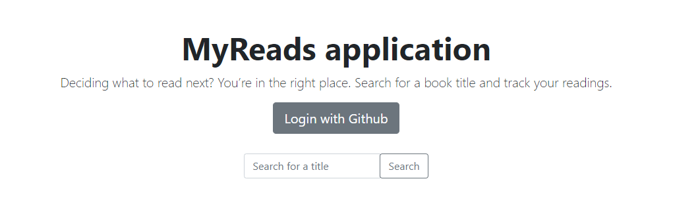
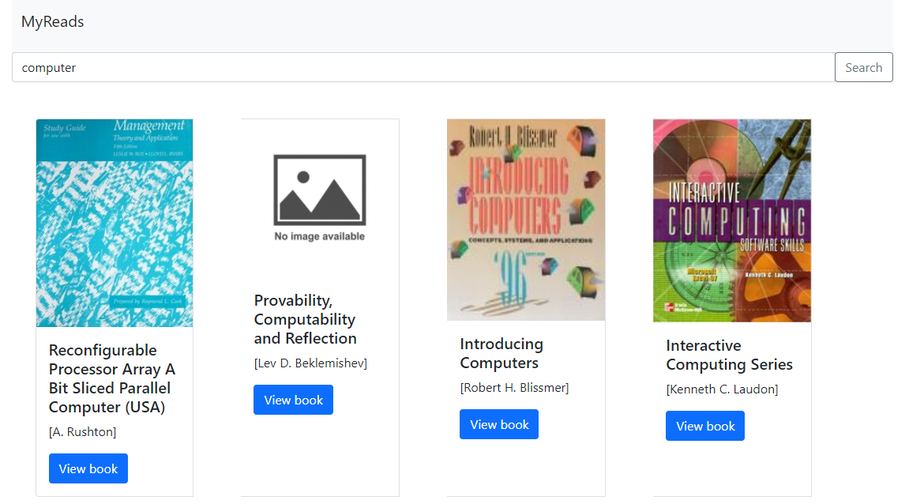
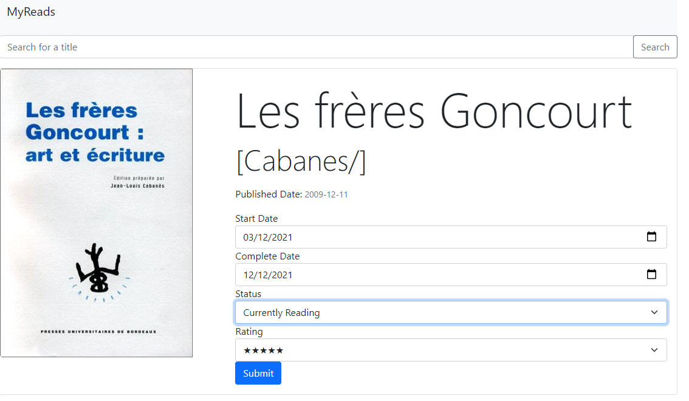
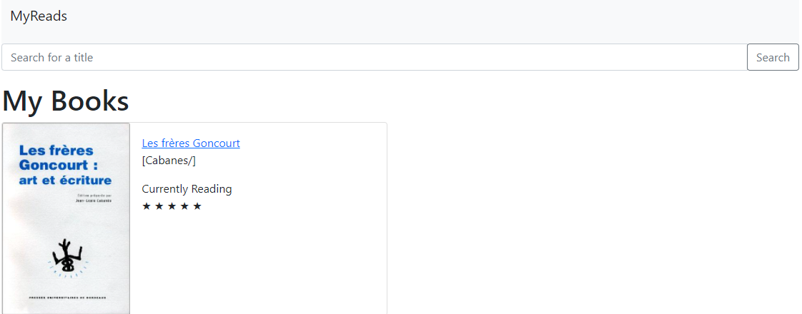

# myreads-application

<!-- TABLE OF CONTENTS -->

  
Table of Contents

  <ol>
    <li>
      <a href="#about-the-project">About The Project</a>
       <ul>
        <li><a href="#goals">Goals</a></li>
        <li><a href="#built-with">Built With</a></li>
      </ul>
    </li>
    <li>
      <a href="#design">Design</a>
    </li>
    <li><a href="#screenshots">Screenshots</a></li>
  </ol>

<!-- ABOUT THE PROJECT -->
## About The Project

This application allows a user to browse through a catalog of books and track the progress of his reading by indicating certain books as read/unread/currently reading and rating the books.

### Goals

* To build a backend-focused application.
* The application should scale and handle large amount of data.
* Good performance.
* Reliability.

### Built With

* [Spring Boot](https://spring.io/projects/spring-boot)
* [Spring Security](https://spring.io/projects/spring-security) : using [OAuth 2.0](https://oauth.net/2/) authorization to login with Github
* [Cassandra](https://cassandra.apache.org/_/index.html) : hosted Cassandra [Astrad DB](https://docs.datastax.com/en/astra/docs/)
* [Thymeleaf](https://www.thymeleaf.org/)
* [OpenLibrary API](https://openlibrary.org/developers/api) 

## Design

This project contains 2 applications :
* myreads-app : the main application
* myreads-preload-data : permits to preload the data for Cassandra database based on dump files downloaded for OpenLibrary API website.

## Screenshots

    
  </a>

    
  </a>

    
  </a>

    
  </a>

